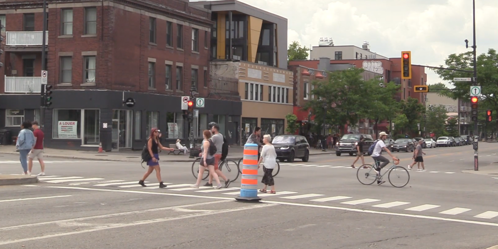
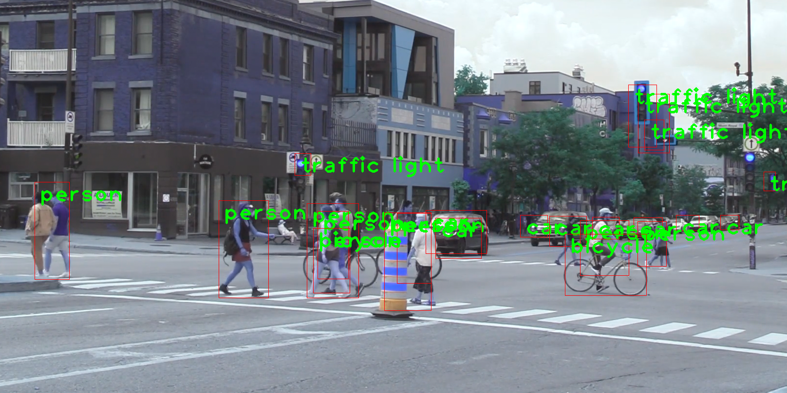

<style>
body {
text-align: justify}
</style>

Object detection is a computer vision technique that involves identifying and locating objects of interest within images or videos. It allows machines to not only recognize what objects are present but also precisely determine their positions through bounding boxes. Recent applications of object detection have been groundbreaking, ranging from autonomous vehicles, where it's used to detect pedestrians and other vehicles for safe driving, to surveillance systems, enabling real-time monitoring and security alerts. In retail, it's employed for shelf inventory management, and in healthcare, it aids in medical image analysis, such as identifying anomalies in X-rays. Moreover, it plays a vital role in enabling augmented reality experiences and interactive gaming, ushering in a new era of user interaction and engagement.

The purpose of this project is to deploy a Python-based application for object detection within both images and videos. Leveraging the powerful capabilities of the OpenCV library, this code employs a range of its methods to accurately locate and track objects of interest. By harnessing OpenCV's extensive functionality, my project aims to provide an application for object detection, serving various applications including surveillance, image analysis, and interactive experiences. The project's outline encompasses the implementation of OpenCV's object detection techniques, customization for specific use cases, and the seamless integration of object tracking within videos.

The following code demonstrates how to perform object detection on both a static image and a video stream using a pre-trained model and OpenCV. It loads the model, reads class labels, sets input parameters, performs detection, and visualizes the results. Let’s first import the necessary libraries: OpenCV for computer vision, NumPy for numerical operations. 

```python
import cv2
import numpy as np
```

Next, we load a pre-trained object detection model in OpenCV. It uses the 'frozen_inference_graph.pb' file as the model's weights and 'ssd_mobilenet_v3_large_coco_2020_01_14.pbtxt' as the model's configuration file.

```python
model = cv2.dnn_DetectionModel('frozen_inference_graph.pb', 'ssd_mobilenet_v3_large_coco_2020_01_14.pbtxt')

```

We also read the class labels from a 'labels.txt' file, which contains the names of the classes the model can detect.

```python
classLables = []
file_name = 'labels.txt'
with open(file_name, 'rt') as fpt:
    classLabels = fpt.read().rstrip('\\n').split('\\n')

```

Then, we set various input parameters for the model:
  - `setInputSize(320, 320)`: Specifies the input size for the model.
  - `setInputScale(1.0/127.5)`: Scales the input pixel values.
  - `setInputMean((127.5, 127.5, 127.5))`: Sets the mean subtraction values for input preprocessing.
  - `setInputSwapRB(True)`: Swaps the Red and Blue channels in the input image.

```python
model.setInputSize(320, 320)
model.setInputScale(1.0/127.5)
model.setInputMean((127.5, 127.5, 127.5))
model.setInputSwapRB(True)

```

Once the setup is done, it is time to read an input image or video and start detecting objects. Let’s begin with an image ('image1.png').

```python
img = cv2.imread('image1.png')

```

The image can be displayed using OpenCV.

```python
cv2.imshow('Image', img)
cv2.waitKey(0)
cv2.destroyAllWindows()
```



The following line of code performs object detection on the image using the pre-trained model with a confidence threshold of 0.5. It returns the class indices, confidence scores, and bounding boxes of detected objects.

```python
ClassIndex, confidence, bbox = model.detect(img, confThreshold=0.5)

```

We then loop through the detected objects and draws bounding boxes around them with their corresponding class labels and confidence scores on the input image.

```python
font_scale = 3
font = cv2.FONT_HERSHEY_PLAIN
for ClassInd, conf, boxes in zip(ClassIndex.flatten(), confidence.flatten(), bbox):
    cv2.rectangle(img, boxes, (255, 0, 0, 2))
    cv2.putText(img, classLabels[ClassInd - 1], (boxes[0]+10, boxes[1]+40), font, fontScale=font_scale, color=(0, 255, 0), thickness=3)

```

And, finally, we display and save the input image with the detected objects.

```python
cv2.imshow('Image with detected objects', cv2.cvtColor(img, cv2.COLOR_BGR2RGB))
cv2.waitKey(0)
cv2.destroyAllWindows()

cv2.imwrite('new_image.png', img)
```





Now, let's explore how to apply a similar approach to a video. The following lines of codes open a video capture using 'video1.mp4' and falls back to the default camera (if 'video1.mp4' is not found).

```python
cap = cv2.VideoCapture('video1.mp4')
if not cap.isOpened():
    cap = cv2.VideoCapture(0)
if not cap.isOpened():
    raise IOError('Cant open the video')

```

Next, we loop through frames in the video, performs object detection on each frame, and displays the frame with bounding boxes and class labels for detected objects. Once we’re done, we press 'q' to exit the video window.

```python
font_scale = 2
font = cv2.FONT_HERSHEY_PLAIN
while True:
    ret, frame = cap.read()  # Read the current frame from the video
    frame = cv2.resize(frame, (0, 0), fx=0.5, fy=0.5)  # Resize the frame

    ClassIndex, confidence, bbox = model.detect(frame, confThreshold=0.55)

    if len(ClassIndex) != 0:
        for ClassInd, conf, boxes in zip(ClassIndex.flatten(), confidence.flatten(), bbox):
            if ClassInd <= 80:
                cv2.rectangle(frame, boxes, (255, 0, 0, 2))
                cv2.putText(frame, classLabels[ClassInd - 1], (boxes[0]+10, boxes[1]+40), font, fontScale=font_scale, color=(0, 255, 0), thickness=3)

    cv2.imshow('Object Detection', frame)

    if cv2.waitKey(2) & 0xff == ord('q'):
        break

cap.release()
cv2.destroyAllWindows()

```


