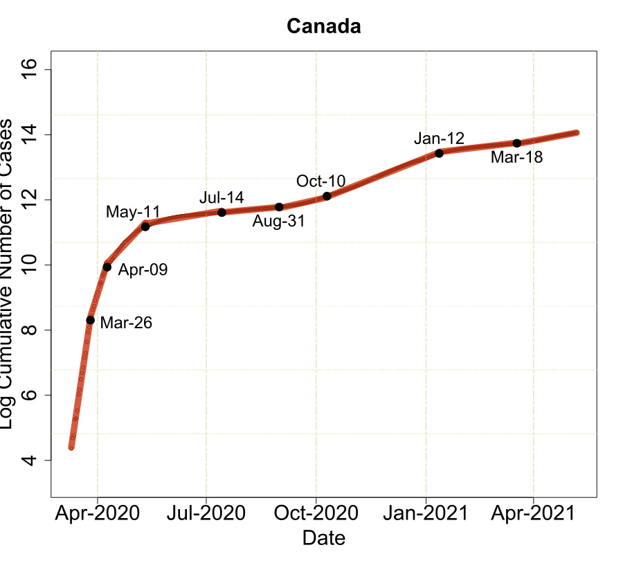
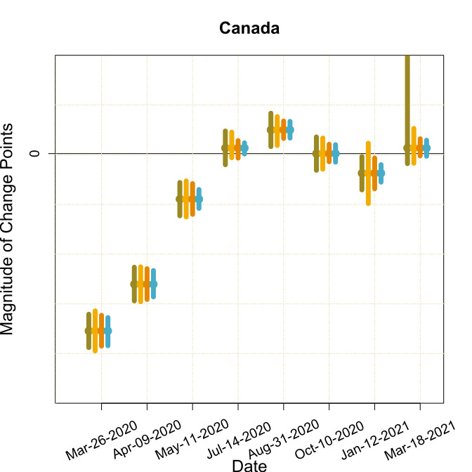

Statistical analysis often involves identifying sudden changes in time series signals. In this project, I will employ the [**Pattern Recovery Using Trend Filtering (PRUTF)**](https://arxiv.org/abs/2009.08573) anomaly detection method, which we introduced in [this paper](https://arxiv.org/abs/2009.08573v1). Afterward, I will discuss performing post-selection statistical inference for the anomalies estimated using PRUTF, as detailed in our [post-selection inference paper](https://arxiv.org/abs/2104.12022). In the following, I will provide a concise overview of the methods presented in these papers and subsequently apply them to the Coronavirus Disease (COVID-19) pandemic dataset.

### Overview of PRUTF and Post-Selection Inference

**Overview of PRUTF:** The paper [Detection of Change Points in Piecewise Polynomial Signals Using Trend Filtering](https://arxiv.org/abs/2009.08573) proposes a new methodology called Pattern Recovery Using Trend Filtering (PRUTF) for identifying unknown change points in piecewise polynomial signals with no continuity restrictions at the change point locations. The paper considers a univariate signal plus noise model, where the signal is deterministic and unknown, with equally spaced input points over the unit interval. Additionally, it is assumed that the signal undergoes unpredictable and distinct changes. With this setup, the objective of this anomaly detection analysis is to estimate the number of anomalies as well as their locations.

Our approach, PRUTF, is inspired by [Tibshirani's method](https://projecteuclid.org/journals/annals-of-statistics/volume-42/issue-1/Adaptive-piecewise-polynomial-estimation-via-trend-filtering/10.1214/13-AOS1189.full) but introduces a modification to accelerate the algorithm's implementation. PRUTF identifies change points at each regularization parameter level and removes some dual variable coordinates after each change point, ensuring independent dual variables between neighboring change points. The paper establishes a stopping criterion crucial for PRUTF's operation. Notably, the dual variables of trend filtering between consecutive change points form a Gaussian bridge process, allowing the introduction of a termination threshold for the algorithm. However, in cases of a staircase pattern in the signal, the method becomes statistically inconsistent. To address this, the paper proposes a modification to PRUTF, providing consistent estimates for both the number and location of change points.

**Overview of Post-Selection Inference for PRUTF:** 
The second paper, [**Valid Post-Detection Inference for Change Points Identified Using Trend Filtering**](https://arxiv.org/abs/2104.12022),mainly focuses on a statistical analysis of anomalies estimated by the PRUTF algorithm. It develops a methodology to perform statistical inference, such as computing p-values and constructing confidence intervals in the newly developed post-selection inference framework. Our work concerns both cases of known and unknown error variance. As pointed out in the post-selection inference literature, the length of such confidence intervals is undesirably long. To resolve this shortcoming, we are also providing two novel strategies, global post-detection and local post-detection which are based on the intrinsic properties of anomalies. 

In this paper, we have made significant contributions, starting with the characterization of the set of anomalies identified by the PRUTF algorithm as a polyhedral set. This innovation facilitates post-selection inference methods for statistical analysis after anomaly detection. Additionally, we introduced a polyhedral stopping criterion for the PRUTF algorithm, derived from the Gaussian bridge property of dual variables, extending its applicability to post-detection inference. We proposed two test statistics—one for known noise variance and another for unknown noise variance—with exact and finite sample distributions under the null hypothesis. These statistics enable inference on the significance of PRUTF-identified anomalies. However, we observed that confidence intervals produced by these methods tend to be excessively wide, which can reduce the power of hypothesis tests. To address this issue, we introduced two novel conditioning methods for post-detection inference. The first method is "local post-detection," which focuses solely on the target anomaly independently of others, while the second is "global post-detection," emphasizing the analysis of the entire set of anomalies.

### Application to the Covid-19 Pandemic Dataset

The **COVID-19 pandemic** has had a profound impact worldwide, straining public health systems and disrupting societies and economies. Countries around the globe had implemented various regional and national policies, such as declaring national emergencies, imposing quarantines, and conducting mass testing, in a collective effort to slow down the transmission rate. Governments were keenly interested in comprehending the dynamics of the pandemic and assessing the efficacy of these measures. This understanding can be gleaned by analyzing COVID-19 infection data. Anomaly detection serves as a valuable framework for studying the patterns in COVID-19 infection curves. By identifying the points at which these curves change significantly, anomaly analysis provides insights into shifts in transmission rates and the impact of interventions. It also enables the early detection of changes in the disease's behavior.

In this analysis, I focus on the log-scale of the cumulative number of confirmed cases in Canada between March 10, 2020, and April 30, 2021. Using the PRUTF method, I detected anomalies in Canada. Subsequently, I fitted a piecewise linear model to the data using these selected anomalies, offering a clearer view of how the growth rate evolved over time. The following figure illustrates the detected anomaly locations using the PRUTF algorithm, along with the estimated linear trend. The algorithm identified eight anomalies for Canada on the following dates: March 26, 2020; April 9, 2020; May 11, 2020; July 14, 2020; August 31, 2020; October 10, 2020; January 12, 2021; and March 18, 2021. The figure visualizes the segments created by these estimated anomalies and their corresponding growth rates.

<!--  -->

Next, in the following, I will employ the proposed post-detection inference methods to assess the significance of the anomalies estimated using PRUTF for the dataset. The following figure provides the 95 percent post-detection confidence intervals for the identified anomalies. For this Canada dataset, the polyhedron and local post-detection inference approaches reveal that the anomalies occurring on March 26, 2020; April 9, 2020; May 11, 2020; August 31, 2020; and January 12, 2021 are statistically significant. 

<!--  -->

